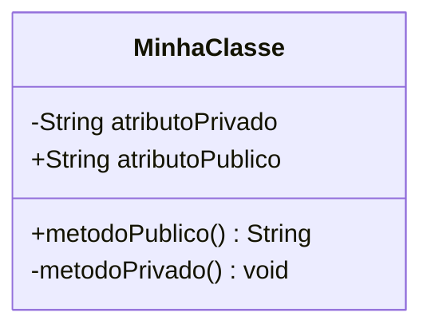
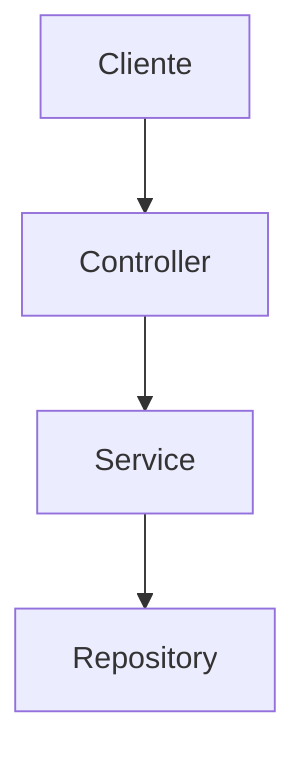
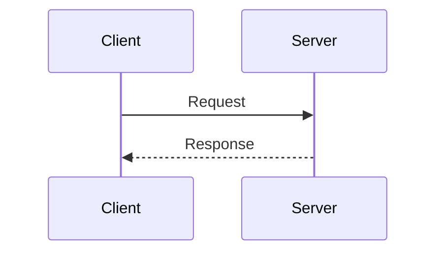

# Diagramas do Projeto

Este documento apresenta os diagramas utilizados no projeto e as ferramentas recomendadas para visualização.

## 🛠️ Ferramenta Recomendada: Mermaid

### Por que Mermaid?

1. **✅ Renderização Nativa no GitHub/GitLab**
   - Visualização direta nos README.md
   - Não precisa de ferramentas externas

2. **✅ Versionamento com o Código**
   - Diagramas como código
   - Histórico de mudanças
   - Sincronizado com o desenvolvimento

3. **✅ Sintaxe Simples**
   - Fácil de escrever e manter
   - Menos propenso a erros

4. **✅ Suporte no VS Code**
   - Extensões para preview
   - Syntax highlighting

### Extensões VS Code Recomendadas

```
Nome: Mermaid Markdown Syntax Highlighting
ID: bpruitt-goddard.mermaid-markdown-syntax-highlighting

Nome: Markdown Preview Mermaid Support
ID: bierner.markdown-mermaid
```

## 📊 Diagramas do Projeto

### 1. Diagrama de Classes (Domínio)
- **Localização:** README.md (seção "Diagrama de Classes")
- **Tipo:** `classDiagram`
- **Propósito:** Modelagem das entidades e relacionamentos

### 2. Diagrama de Arquitetura (Spring Boot)
- **Localização:** README.md (seção "Arquitetura da API REST")
- **Tipo:** `graph TB` (Top-Bottom)
- **Propósito:** Visualizar camadas da aplicação Spring Boot

### 3. Diagrama de Sequência (Fluxo de Requisição)
- **Localização:** README.md (seção "Fluxo de uma Requisição")
- **Tipo:** `sequenceDiagram`
- **Propósito:** Mostrar o fluxo de uma requisição HTTP

## 🔧 Como Visualizar

### No GitHub/GitLab
- Abra o README.md diretamente no navegador
- Os diagramas renderizam automaticamente

### No VS Code
1. Instale as extensões recomendadas
2. Abra o README.md
3. Use `Ctrl+Shift+V` para preview

### Online (Mermaid Live Editor)
- Acesse: https://mermaid.live/
- Cole o código Mermaid
- Edite e visualize em tempo real

### Outras Ferramentas

#### Para diagramas mais complexos:
- **Draw.io/Diagrams.net** - Diagramas visuais complexos
- **PlantUML** - Alternativa ao Mermaid (mais verboso)
- **Lucidchart** - Ferramenta comercial profissional

#### Para documentação arquitetural:
- **C4 Model** - Para arquitetura de software
- **ArchiMate** - Para arquitetura empresarial

## 📝 Templates Mermaid

### Diagrama de Classe Básico


### Diagrama de Arquitetura Básico


### Diagrama de Sequência Básico


## 🎯 Benefícios da Abordagem Atual

1. **Documentação Viva:** Diagramas evoluem com o código
2. **Acessibilidade:** Visível para toda a equipe no repositório
3. **Manutenibilidade:** Fácil de atualizar e versionar
4. **Padronização:** Sintaxe consistente e profissional
5. **Integração:** Funciona nativamente com ferramentas Git