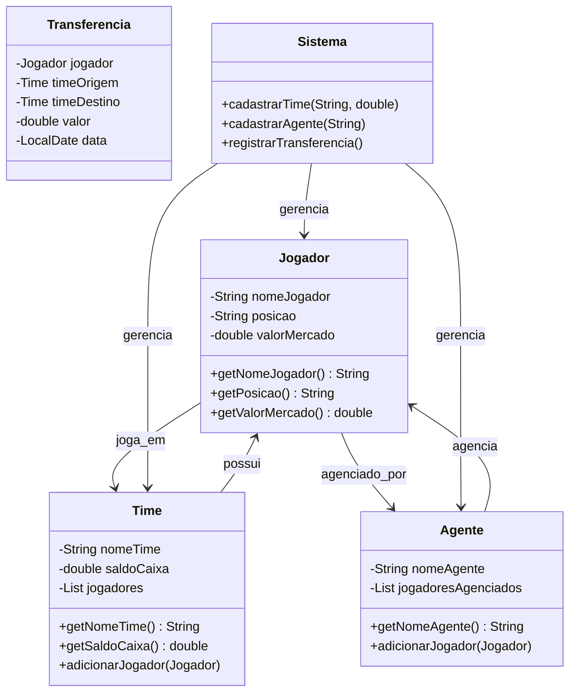
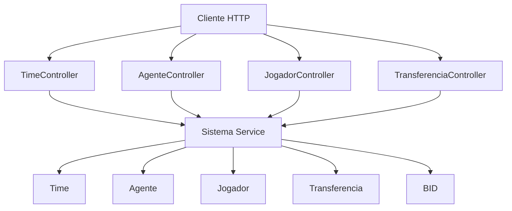
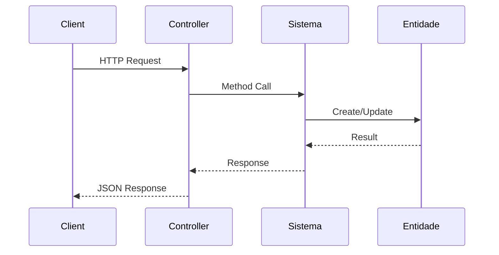

# Trabalho-LP2

Trabalho final de LP2

Este é o trabalho final de LP2, o tema será um sistema gerenciador de elencos com transferências de jogadores do plantel de diversos times.

## Diagrama de Classes

## Arquitetura da API REST (Spring Boot)

## Fluxo de uma Requisição

## Roadmap

- [x] Modelagem das classes principais (Jogador, Time, Agente, Contrato, Transferencia, BID)
- [x] Implementação dos métodos CRUD nas entidades
- [x] Centralização das operações na classe Sistema
- [x] Atualização do diagrama de classes
- [x] Implementação de interface de usuário (no terminal)
- [x] Validações e tratamento de erros
- [x] Testes automatizados
- [x] **Fase 1: Backend (API REST com Java)**
    - [x] Estruturar projeto com **Spring Boot**
    - [x] Migrar lógica de negócio para um `@Service`
    - [x] Criar `Controllers` para expor a lógica como API REST
- [ ] **Fase 2: Frontend (Interface Web com Next.js)**
    - [ ] Iniciar projeto com **Next.js**
    - [ ] Gerar telas com **v0.dev**
    - [ ] Conectar frontend com a API usando **Copilot**
- [ ] **Fase 3: Hospedagem e Deploy**
    - [ ] Fazer deploy do Backend Java no **Render**
    - [ ] Fazer deploy do Frontend Next.js na **Vercel**
    - [ ] Configurar conexão entre frontend e backend na nuvem
- [ ] Persistencia de dados em .csv (não implementado)

## 📊 Visualização dos Diagramas

### ⚠️ Problemas de Renderização?

Se os diagramas não estiverem aparecendo:

1. **No GitHub**: 
   - Os diagramas Mermaid devem renderizar automaticamente
   - Se não aparecerem, veja o arquivo `github-test.md` para testes simples

2. **No VS Code**:
   - Instale: "Markdown Preview Mermaid Support" (já instalado)
   - Use `Ctrl+Shift+V` para preview
   - Se não funcionar, tente a extensão "Mermaid Preview"

3. **Online - Mermaid Live Editor**:
   - Acesse: https://mermaid.live/
   - Cole o código do diagrama para testar
   - Copie a sintaxe corrigida de volta

### 🔧 Teste de Funcionamento
- **github-test.md** - Diagramas de teste simples
- **teste-mermaid.md** - Testes básicos de sintaxe

### 📚 Documentação
- **DIAGRAMAS.md** - Guia completo de ferramentas e sintaxe
- **README.md** - Diagramas do projeto (este arquivo)
