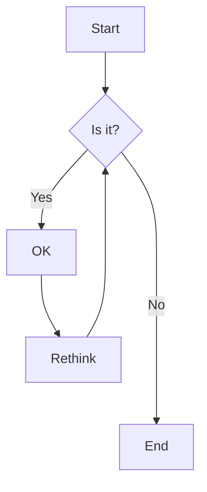
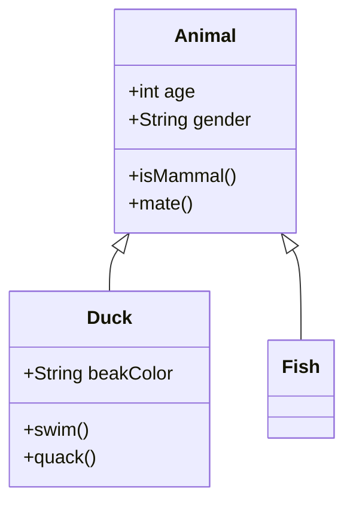
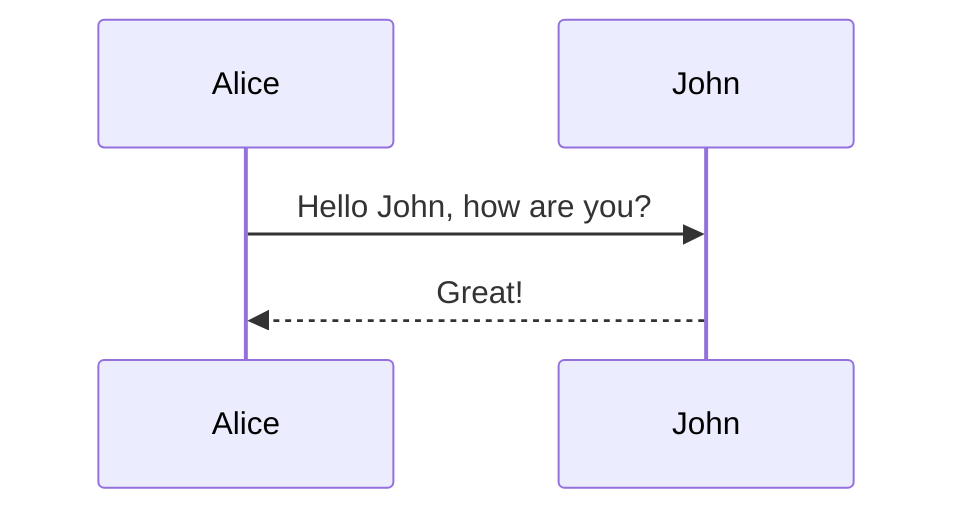

# Teste GitHub Mermaid

Este é um teste para verificar se os diagramas Mermaid funcionam no GitHub.

## Teste 1: Fluxograma Simples

## Teste 2: Diagrama de Classe Simples

## Teste 3: Sequência

