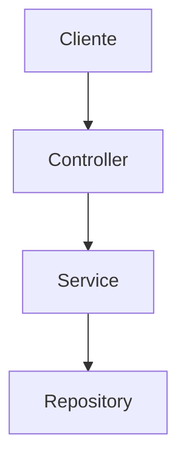
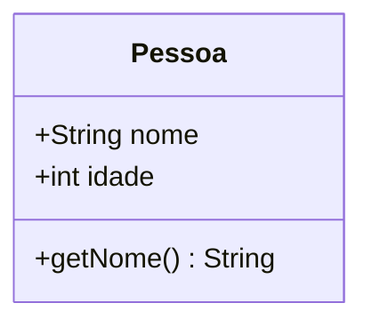
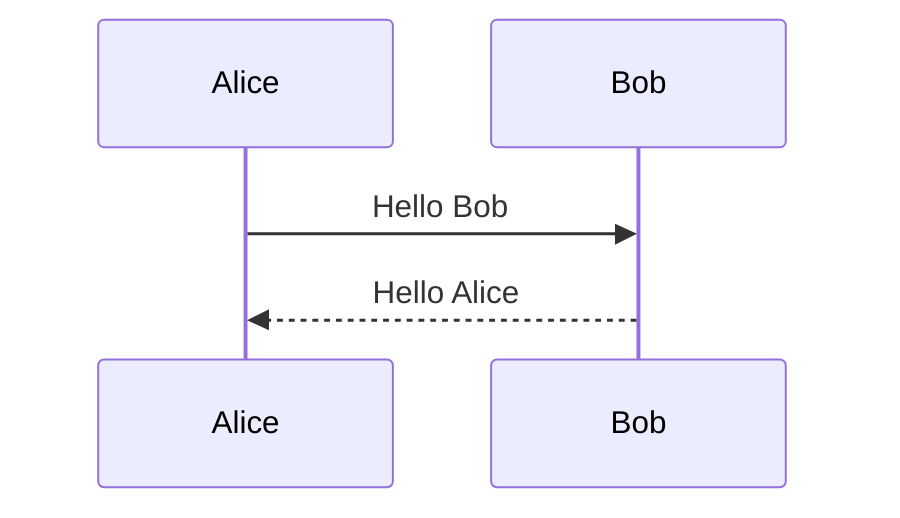

# Teste de Diagramas Mermaid

## Teste 1: Diagrama Simples

```mermaid
graph TD
    A[Cliente] --> B[Controller]
    B --> C[Service]
    C --> D[Repository]
```

## Teste 2: Diagrama de Classe Simples

```mermaid
classDiagram
    class Pessoa {
        +String nome
        +int idade
        +getNome() String
    }
```

## Teste 3: Sequence Diagram

```mermaid
sequenceDiagram
    Alice->>Bob: Hello Bob
    Bob-->>Alice: Hello Alice
```